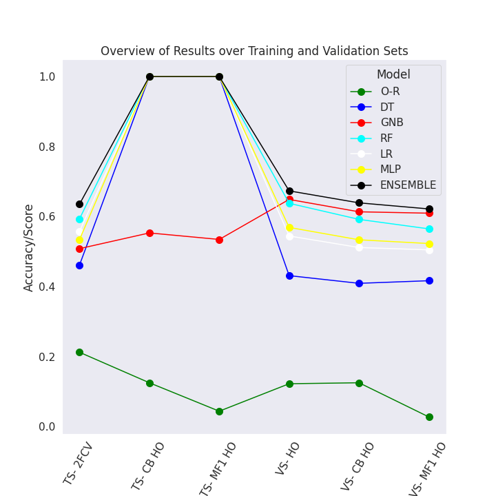

# Music Genre Classification
## Task
> - Develop machine learning models which predict the music genre based on a diverse set of features, capturing audio features of the track, as well as song metadata such as its title, key, duration, and textual tags representing the words in the song lyrics. 
> - Implement and analyze different machine learning models in their performance; and explore the utility of the different types of features for music genre prediction. 
> - Use a holdout strategy to evaluate the trained model using a validation and test set.

## Dataset
The features and class labels are derived from the following published data sets:

- T. Bertin-Mahieux, D. P.W. Ellis, B. Whitman, and P. Lamere. The million song dataset. In
Proceedings of the 12th International Conference on Music Information Retrieval (ISMIR), 2011.
- A. Schindler and A. Rauber. Capturing the temporal domain in Echonest Features for improved
classification effectiveness. In Proceedings of the 10th International Workshop on Adaptive Multimedia Retrieval (AMR), 2012.

### Data splits and format
The dataset consists of audio, metadata, and text features for 8556 songs, as well as their
genre labels. The songs are split into a training set (7678 songs), validation set (450 songs)
and test set (428 songs). A `features.csv` and `labels.csv` is provided for each data split. 

### Features
The feature files contain the following columns:

* `trackID`: unique identifier for each song.
* `title`: title of the song.
* `tags`: A comma-separated list of tags representing the words that appeared in the lyrics of the song and are assigned by human annotators.
* `loudness`: overall loudness in dB.
* `tempo`: estimated tempo in beats per minute.
* `time_signature`: estimated number of beats per bar.
* `key`: key the track is in.
* `mode`: major or minor.
* `duration`: duration of the song in seconds.
* `vect_1` --`vect_148`: 148 columns containing pre-computed audio features of each song. These features were pre-extracted from the 30 or 60 second snippets, and capture timbre, chroma, and MFCC aspects of the audio.

### Labels

The label files contain the following columns:

* `trackID`: unique identifier for each song.
* `genre`: the genre label.

All genre labels are taken from the following set of 8 genres:

1. Soul and Reggae
2. Pop
3. Punk
4. Jazz and Blues
5. Dance and Electronica
6. Folk
7. Classic Pop and Rock
8. Metal

## Introduction

In this project, we find a set of features derived from the full set and use them for genre classification on several models. We aim to show the following:
1. A stacking ensemble is valuable for genre classification
2. Our stacking ensemble outperforms all of its base estimators

## `report.pdf`

Open `report.pdf` to read my full research report, where we delve into the dataset to engineer and extract an expressive and tractable set of features. We compare the performance of a stacking ensemble to four standalone methods, as well as Zero-R and a Decision Tree. We explore how it can be applied to Music Genre Classification and harness the unique strengths of its base estimators by using their output as input to a Logistic Regression meta classifier.

## `analysis.ipynb`
Open `analysis.ipynb` to follow how I:
* Loaded and preprocessed the data
* Selected and engineered a set of features
* Implemented the various models for training and predicting
* Evaluated and analyzed performance

If you `Restart and Run All Cells`, it should take 45+ minutes to run to completion.

### Steps

The steps taken are:
1. Define `X` and `y`, diving `X` into train, valid, and test sets, as well as three feature categories: text, audio, and metadata.
2. Explore data distributions, namely the distributions of class and features.
3. Apply `PorterStemmer()` to title column.
4. Concatenate Title and Tags columns, and apply `TfidfVectorizer()` to resulting column.
5. Filter textual features with Mutual Information, remove if <= 0.0001
6. Filter metadata features with Correlation Coefficient, if > 0.8
7. Filter metadata features with Mutual Information, remove if <= 0.0001
8. Select the top K features, sorted by MI, using Random Forest on train set.
9. Filter audio features with Mutual Information, remove if <= 0.0001
10. Select the top K features, sorted by MI, using Gaussian Naive Bayes on train set.
11. Define Train, Predict, and Evaluate functions.
12. Evaluate models on training and validation sets, storing these results for later plotting.
13. Analyze results with tabular and graphical visuals.

## `analysis_supplementary.ipynb`
Open `analysis_supplementary.ipynb` to view the textual features' Mutual Information scores on a `one genre vs. rest` basis. We just investigate three genres: Folk, Metal, and Dance and Electronica.

If you `Restart and Run All Cells`, it should take 30+ minutes to run to completion.

### Steps

The steps taken are:

1. Define `X` and `y`, dividing `X` into train set and just one feature category: text.
2. Binarize `y` labels Folk, Metal, and Dance and Electronica.
3. Apply `PorterStemmer()` to title column.
4. Concatenate Title and Tags columns, and apply `TfidfVectorizer()` to resulting column.
5. Calculate Mutual Information score of each word root with three binarized `y` labels individually.
6. Display the top 20 highest Mutual Information scoring word roots for each of the three genres we have selected.

## Results

We found that the stacking ensemble was indeed valuable in predicting music genre and could outperform all of its base estimators, as can be seen in Figure 1.

The vertical axis represents the accuracy scored by the model, while the horizontal axis denotes the test-sets used. Each line in the plot is a different model, color-coded as per the legend. 

Note the following test set abbreviations:

Abbreviated Form| Meaning
------------ | -------------
TS-2FCV | Accuracy on training set, using a stratified-variant of 2- Fold Cross Validation (2FCV)
TS-CB HO | Simple average of each class’s accuracy on training set, using holdout strategy (HO)
TS-MF1 HO | F-measure where relative contribution of precision and recall are equal on training set, using HO
VS-HO | Accuracy on validation set, using HO
VS-CB HO | Same as TS-CB HO, except on validation set
VS-MF1 HO | Same as TS-MF1 HO, except on validation set

### Overview

  

# License
[MIT](https://choosealicense.com/licenses/mit/)
